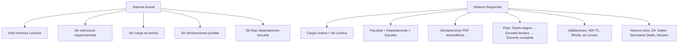

# Transformación: Sistema de Horarios → Sistema de Gestión de Carga Académica Integral

## Análisis del Sistema Actual

### Lo que EXISTE hoy

| Componente | Estado | Detalle |
|---|---|---|
| **Stack** | Next.js 16 + tRPC + Prisma + PostgreSQL + TailwindCSS 4 + Vitest | Sólido, moderno |
| **Roles** | `ADMIN`, `DOCENTE`, `ESTUDIANTE`, `INVITADO`, `SECRETARIA_ACADEMICA`, `DIRECTOR_ESCUELA` | Faltan roles clave |
| **Modelo Docente** | Nombre, email, categoría (4), tipo (Nombrado/Contratado), antigüedad | Falta modalidad, DNI, código IBM, facultad, departamento |
| **Cursos** | Código, nombre, créditos, horas teoría/lab, ciclo, perfil requerido | Falta escuela profesional, currícula, horas práctica |
| **Asignación** | `Asignacion` = docente + grupo + aula + franja + periodo + tipo | Solo slots horarios, NO separa carga lectiva de no lectiva |
| **Grupos** | Nombre (A, B, C) ligado a curso y periodo | No distingue secciones de teoría vs grupos de laboratorio |
| **Motor de scheduling** | `ScheduleEngine` greedy + `AvailabilityService` | Funcional pero no contempla carga completa |
| **Reportes PDF** | Puppeteer: por aula, docente, ciclo, gestión | NO genera los formatos institucionales requeridos |
| **Dashboard** | Diferenciado por rol (Admin, Secretaria, Director, Docente, Invitado) | Bien diseñado pero le faltan módulos |

### Lo que FALTA (Gap Analysis)



> [!IMPORTANT]
> El cambio NO es cosmético. Es una **reestructuración del dominio**. El sistema actual modela "asignación de slots horarios". El sistema requerido modela "gestión completa de la carga académica de un docente universitario" — que INCLUYE horarios pero es mucho más amplio.

---

## User Review Required

> [!WARNING]
> **Cambio de esquema de base de datos**: Se requiere una migración que agrega ~10 tablas nuevas y modifica ~4 existentes. Esto NO es reversible fácilmente. ¿Hay datos en producción que debamos preservar?

> [!IMPORTANT]
> **Roles nuevos**: Necesitamos agregar `DIRECTOR_DEPARTAMENTO`, `SECRETARIA_DEPARTAMENTO`, y `DECANO`. Esto cambia el sistema de permisos. ¿El `DIRECTOR_ESCUELA` actual pasa a ser `DIRECTOR_DEPARTAMENTO`?

---

## Open Questions

> [!IMPORTANT]
> 1. **¿La base de datos actual tiene datos reales o solo seed?** — Impacta si hacemos reset o migración incremental.
> 2. **¿El "Director de Escuela" actual del sistema es el mismo que el "Director de Departamento" que mencionás en los requerimientos?** — En universidades peruanas son roles distintos (departamento = agrupación docente, escuela = agrupación de plan de estudios).
> 3. **¿Los cursos pertenecen a una sola escuela o pueden ser compartidos entre escuelas?** — Afecta la relación Curso ↔ Escuela.
> 4. **¿Sábados se incluyen como posibles días de clase?** — El sistema actual solo tiene Lunes-Viernes.
> 5. **¿El sistema debe manejar múltiples facultades o solo Ingeniería?** — Simplifica mucho si es una sola.

---

## Proposed Changes

### Componente 1: Estructura Organizacional (Prisma Schema)

Nuevos modelos para representar la jerarquía universitaria.

#### [MODIFY] [schema.prisma](file:///c:/Users/Harry/Documents/CICLO%207/ING.%20SOFTWARE/SEM7/sistema-horarios-v2/prisma/schema.prisma)

**Nuevos Enums:**
```prisma
enum ModalidadDocente {
  TIEMPO_COMPLETO        // 40 horas
  DEDICACION_EXCLUSIVA   // 40 horas, solo UNT
  TIEMPO_PARCIAL         // Variable (20h, etc.)
}

enum EstadoDeclaracion {
  BORRADOR
  ENVIADA
  APROBADA_DEPARTAMENTO
  APROBADA_ESCUELA
  RECHAZADA
  FINALIZADA
}

enum TipoCargaNoLectiva {
  PREPARACION_EVALUACION
  CONSEJERIA
  INVESTIGACION
  CAPACITACION
  GOBIERNO
  ADMINISTRACION
  ASESORIA_TESIS
  RESPONSABILIDAD_SOCIAL
  COMITES_COMISIONES
}

enum DiaSemana {
  LUNES
  MARTES
  MIERCOLES
  JUEVES
  VIERNES
  SABADO  // ← NUEVO: excepciones
}
```

**Nuevos Modelos:**

```prisma
model Facultad {
  id          String   @id @default(cuid())
  nombre      String   @unique
  siglas      String   @unique
  // ...
  departamentos Departamento[]
  escuelas      Escuela[]
}

model Departamento {
  id          String   @id @default(cuid())
  nombre      String
  facultadId  String
  directorId  String?  // User con rol DIRECTOR_DEPARTAMENTO
  secretariaId String? // User con rol SECRETARIA_DEPARTAMENTO
  // ...
  facultad    Facultad @relation(...)
  docentes    Docente[]
}

model Escuela {
  id          String   @id @default(cuid())
  nombre      String
  facultadId  String
  directorId  String?  // User con rol DIRECTOR_ESCUELA
  // ...
  facultad    Facultad @relation(...)
  curriculas  Curricula[]
}

model Curricula {
  id          String   @id @default(cuid())
  codigo      String   @unique  // "2018", "2023"
  escuelaId   String
  vigente     Boolean  @default(true)
  // ...
  escuela     Escuela  @relation(...)
  cursos      CursoCurricula[]
}

model CursoCurricula {
  id          String   @id @default(cuid())
  cursoId     String
  curriculaId String
  ciclo       Int
  esElectivo  Boolean  @default(false)
  // ...
  curso       Curso    @relation(...)
  curricula   Curricula @relation(...)
}
```

**Modificaciones a Docente:**
```prisma
model Docente {
  // ... campos existentes ...
  
  // NUEVOS
  dni               String?   @unique
  codigoIBM         String?   @unique @map("codigo_ibm")
  modalidad         ModalidadDocente @default(TIEMPO_COMPLETO)
  departamentoId    String?   @map("departamento_id")
  horasContrato     Int       @default(40) @map("horas_contrato")
  dictaOtraUniversidad Boolean @default(false) @map("dicta_otra_universidad")
  
  departamento      Departamento? @relation(...)
  declaraciones     DeclaracionCarga[]
  cargasNoLectivas  CargaNoLectiva[]
  asignacionesCarga AsignacionCargaLectiva[]
}
```

**Modelos para Carga Lectiva (asignada por Departamento):**
```prisma
model AsignacionCargaLectiva {
  id              String   @id @default(cuid())
  docenteId       String
  grupoId         String
  periodoId       String
  tipo            TipoAsignacion  // TEORIA, PRACTICA, LABORATORIO
  horasAsignadas  Int
  compartido      Boolean  @default(false)
  // Referencia al docente con quien comparte (si aplica)
  docenteCompartidoId String?
  
  docente         Docente  @relation(...)
  grupo           Grupo    @relation(...)
  periodo         PeriodoAcademico @relation(...)
}
```

**Modelo para Carga No Lectiva:**
```prisma
model CargaNoLectiva {
  id              String   @id @default(cuid())
  docenteId       String
  periodoId       String
  tipo            TipoCargaNoLectiva
  horas           Int
  descripcion     String?  @db.Text
  
  // Campos específicos por tipo
  codigoProyecto  String?  @map("codigo_proyecto")   // Para INVESTIGACION
  nombreProyecto  String?  @map("nombre_proyecto")   // Para INVESTIGACION
  numAlumnos      Int?     @map("num_alumnos")       // Para CONSEJERIA
  cicloConsejeria String?  @map("ciclo_consejeria")  // Para CONSEJERIA
  
  docente         Docente  @relation(...)
  periodo         PeriodoAcademico @relation(...)
}
```

**Modelo para Declaración de Carga (FORMATO N°1 + control de flujo):**
```prisma
model DeclaracionCarga {
  id              String   @id @default(cuid())
  docenteId       String
  periodoId       String
  estado          EstadoDeclaracion @default(BORRADOR)
  
  // Totales calculados
  totalHorasLectivas    Int @default(0)
  totalHorasNoLectivas  Int @default(0)
  totalHoras            Int @default(0)
  
  // Aprobaciones
  aprobadoDepartamentoId  String?
  fechaAprobacionDepto    DateTime?
  aprobadoEscuelaId       String?
  fechaAprobacionEscuela  DateTime?
  vistoBuenoDecanoId      String?
  fechaVistoBueno         DateTime?
  
  // Declaración jurada
  declaracionJuradaFirmada  Boolean @default(false)
  declaracionSedesFirmada   Boolean @default(false)
  
  createdAt DateTime @default(now())
  updatedAt DateTime @updatedAt
  
  docente   Docente  @relation(...)
  periodo   PeriodoAcademico @relation(...)
}
```

**Nuevos Roles en UserRole:**
```prisma
enum UserRole {
  ADMIN
  DOCENTE
  ESTUDIANTE
  INVITADO
  SECRETARIA_ACADEMICA
  DIRECTOR_ESCUELA
  DIRECTOR_DEPARTAMENTO    // ← NUEVO
  SECRETARIA_DEPARTAMENTO  // ← NUEVO
  DECANO                   // ← NUEVO
}
```

---

### Componente 2: Módulo Curso (Ampliación)

#### [MODIFY] [schema.prisma](file:///c:/Users/Harry/Documents/CICLO%207/ING.%20SOFTWARE/SEM7/sistema-horarios-v2/prisma/schema.prisma) — Modelo Curso

Agregar `horasPractica` al modelo Curso y la relación con `CursoCurricula`.

```prisma
model Curso {
  // ... existentes ...
  horasPractica     Int @default(0) @map("horas_practica")  // ← NUEVO
  
  cursoCurriculas   CursoCurricula[]
}
```

#### [MODIFY] [schema.prisma](file:///c:/Users/Harry/Documents/CICLO%207/ING.%20SOFTWARE/SEM7/sistema-horarios-v2/prisma/schema.prisma) — Modelo Grupo

Agregar campo `seccion` y `numAlumnos` al Grupo.

```prisma
model Grupo {
  // ... existentes ...
  seccion     String?   // "A", "B" para la sección general
  numAlumnos  Int       @default(0) @map("num_alumnos")
  
  asignacionesCarga AsignacionCargaLectiva[]
}
```

---

### Componente 3: Backend — Nuevos tRPC Routers

#### [NEW] cargaLectiva.ts
Router para la gestión de asignación de carga lectiva por el Departamento:
- `asignar` — Secretaria de Departamento asigna carga a docente (teoría, práctica, laboratorio)
- `compartir` — Marcar curso compartido entre dos docentes
- `listarPorDocente` — Ver carga lectiva de un docente
- `listarPorPeriodo` — Ver toda la carga del periodo
- `eliminar` — Remover asignación

#### [NEW] cargaNoLectiva.ts
Router para la gestión de carga no lectiva por el Docente:
- `guardar` — Docente llena sus horas no lectivas
- `listarPorDocente` — Ver carga no lectiva
- `calcularPreparacion` — Auto-calcula 10% de trabajo lectivo para preparación

#### [NEW] declaracion.ts
Router para el flujo de declaraciones:
- `crear` — Crear declaración borrador
- `enviar` — Docente envía para aprobación
- `aprobarDepartamento` — Director Depto aprueba
- `aprobarEscuela` — Director Escuela aprueba
- `vistoBuenoDecano` — Decano da VB
- `rechazar` — Con motivo
- `obtenerPorDocente` — Estado actual
- `listarPendientes` — Para aprobadores

#### [NEW] declaracionPDF.ts
Router para generación de PDFs de declaraciones:
- `formatoN1` — Declaración de Carga Horaria Asignada
- `formatoN2` — Declaración Jurada Sede Central
- `formatoN3` — Declaración Jurada Sedes Descentralizadas
- `paqueteCompleto` — Los 3 formatos en un solo PDF

#### [NEW] departamento.ts
Router CRUD para departamentos académicos.

#### [NEW] escuela.ts
Router CRUD para escuelas profesionales.

#### [NEW] facultad.ts
Router CRUD para facultades.

#### [MODIFY] [_app.ts](file:///c:/Users/Harry/Documents/CICLO%207/ING.%20SOFTWARE/SEM7/sistema-horarios-v2/src/server/trpc/routers/_app.ts)
Registrar todos los nuevos routers.

#### [MODIFY] [init.ts](file:///c:/Users/Harry/Documents/CICLO%207/ING.%20SOFTWARE/SEM7/sistema-horarios-v2/src/server/trpc/init.ts)
Agregar procedures para los nuevos roles: `directorDepartamentoProcedure`, `secretariaDepartamentoProcedure`, `decanoProcedure`.

---

### Componente 4: Frontend — Nuevas Vistas del Sistema

Estas son las vistas que propongo para cubrir TODO el flujo descrito. Cada vista agrupa funcionalidad coherente para que el sistema sea ROBUSTO sin ser redundante.

#### Vista 1: Gestión de Carga Lectiva (Departamento)
**Ruta:** `/carga-lectiva`
**Acceso:** Secretaria de Departamento, Director de Departamento, Admin
**Funcionalidad:**
- Tabla con todos los docentes del departamento y su carga asignada
- Modal de asignación: seleccionar curso → tipo (T/P/L) → grupo → horas
- Soporte para **cursos compartidos** entre docentes
- Indicador visual de carga actual vs máximo permitido por modalidad
- Botón para generar sugerencia automática de distribución
- Filtros por: categoría docente, modalidad, estado de carga

#### Vista 2: Carga No Lectiva (Docente)
**Ruta:** `/carga-no-lectiva`
**Acceso:** Docente (su propia carga), Admin
**Funcionalidad:**
- Formulario con las 9 categorías de actividades no lectivas
- Auto-cálculo de "Preparación y Evaluación" (máx 50% de lectiva)
- Campos condicionales: proyecto de investigación con código/nombre, consejería con N° alumnos y ciclo
- Barra de progreso: horas lectivas + no lectivas vs total requerido (40h TC)
- Validación en tiempo real del total de horas

#### Vista 3: Declaración de Carga Horaria (Flujo completo)
**Ruta:** `/declaraciones`
**Acceso:** Todos los roles (vista diferenciada)
**Funcionalidad:**
- **Docente**: Ve su declaración actual, estado del flujo, puede editar si es BORRADOR
- **Director Depto**: Lista de declaraciones pendientes de su departamento, aprueba/rechaza
- **Director Escuela**: Lista de declaraciones pendientes de su escuela, aprueba/rechaza
- **Decano**: Vista general con VB pendientes
- Timeline visual del estado: Borrador → Enviada → Aprobada Depto → Aprobada Escuela → VB Decano → Finalizada
- Generación de PDFs desde cada declaración

#### Vista 4: Horario Personal (Docente completa con carga no lectiva)
**Ruta:** `/horario-personal`
**Acceso:** Docente
**Funcionalidad:**
- Grilla semanal (Lun-Sáb, 7am-9pm)
- Carga LECTIVA pre-cargada (read-only, viene del departamento)
- Bloques de carga NO LECTIVA: docente arrastra o selecciona slots para completar horas
- Validaciones en tiempo real:
  - Máximo 8 horas diarias
  - Máximo 40 horas semanales (TC/DE)
  - Sin cruces de horario
  - Total = carga lectiva + carga no lectiva = horas contrato
- Vista previa tipo "Formato N°1"

#### Vista 5: Gestión Docente (Ampliada)
**Ruta:** `/docentes` (modificar existente)
**Acceso:** Admin, Secretaria Depto
**Funcionalidad (agregar):**
- Campos nuevos: DNI, Código IBM, Modalidad, Departamento, ¿Dicta en otra universidad?
- Indicador de carga completa/pendiente por periodo
- Historial de declaraciones

#### Vista 6: Estructura Organizacional
**Ruta:** `/organizacion`
**Acceso:** Admin
**Funcionalidad:**
- CRUD de Facultades, Departamentos, Escuelas
- Asignación de Director y Secretaria a cada unidad
- Vista de currícula por escuela

#### Vista 7: Formatos y Documentos
**Ruta:** `/formatos`
**Acceso:** Docente (sus propios), Admin (todos)
**Funcionalidad:**
- Lista de declaraciones del docente con estado
- Botones para descargar cada formato PDF:
  - Formato N°1: Declaración de Carga Horaria Asignada
  - Formato N°2: Declaración Jurada (Sede Central)
  - Formato N°3: Declaración Jurada (Sedes Descentralizadas)
- Preview en pantalla antes de descargar
- Historial de documentos generados

#### Vista 8: Dashboard (Ampliado)
**Ruta:** `/` (modificar existente)
**Acceso:** Todos
**Funcionalidad (agregar):**
- **Director Depto**: KPIs de carga de su departamento, declaraciones pendientes
- **Decano**: Vista de toda la facultad, VB pendientes
- **Docente**: Estado de su declaración, acceso directo a completar carga

---

### Componente 5: Generación de PDFs Institucionales

#### [NEW] src/server/services/reports/declaracion-pdf.ts

Generar HTML para cada formato usando Puppeteer (igual que los reportes existentes):

**Formato N°1** — Declaración de Carga Horaria Asignada:
- Datos del docente (facultad, depto, nombre, condición, categoría, modalidad)
- Periodo académico con fechas
- Tabla de trabajo lectivo (código, curso, currícula, escuela, ciclo, sección, N° alumnos, HT, HP, HL, Total)
- 9 secciones de actividades con horas
- Total general
- 3 líneas de firma (Profesor, Director Depto, VB Decano)

**Formato N°2** — Declaración Jurada Sede Central:
- Texto legal con datos del docente interpolados (nombre, DNI, código IBM, departamento, facultad)
- Declaración de no incompatibilidad
- Modalidad y condición
- Sanciones
- Firma y DNI

**Formato N°3** — Declaración Jurada Sedes Descentralizadas:
- Similar al N°2 pero con normativa específica de sedes
- 5 párrafos normativos con restricciones de horas por modalidad
- Firma y DNI

---

### Componente 6: Validaciones de Negocio

#### [NEW] src/server/services/workload-validator.ts

Servicio centralizado de validaciones:
- `validateDailyHours(docenteId, dia)` — Máximo 8h/día
- `validateWeeklyHours(docenteId)` — Máximo 40h/semana (TC/DE) o según contrato (TP)
- `validateNoOverlap(docenteId, franjaId)` — Sin cruces
- `validateTotalWorkload(docenteId, periodoId)` — Lectiva + No lectiva = Contrato
- `validatePreparacion(horasLectivas, horasPreparacion)` — Máx 50% de lectiva
- `validateNotTeachingElsewhere(docenteId)` — Si marcó que dicta en otra universidad, restricciones especiales

---

## Verification Plan

### Automated Tests
- Tests unitarios para `workload-validator.ts` (cada regla de negocio)
- Tests de integración para los routers de carga lectiva y no lectiva
- Tests para generación de PDFs (verificar que Puppeteer renderiza correctamente)
- `vitest run` para ejecutar toda la suite

### Manual Verification
- Seed actualizado con datos completos (departamentos, escuelas, carga lectiva/no lectiva)
- Flujo E2E: Admin crea estructura → Secretaria Depto asigna carga → Docente completa no lectiva → Declaración se aprueba → PDF se genera
- Verificar que los PDFs generados coinciden con los formatos institucionales descritos
- Verificar validaciones: intentar exceder 8h/día, 40h/semana, cruces

---

## Estimación de Esfuerzo

| Fase | Archivos | Complejidad |
|---|---|---|
| Schema + Migración | ~1 archivo, ~200 líneas nuevas | Media |
| Seed actualizado | ~1 archivo, ~150 líneas | Media |
| Nuevos routers (5) | ~5 archivos, ~1500 líneas | Alta |
| Validaciones | ~1 archivo, ~200 líneas | Media |
| PDFs institucionales | ~1 archivo, ~500 líneas | Alta |
| Nuevas vistas (6) | ~8 archivos, ~4000 líneas | Alta |
| Modificar vistas existentes (2) | ~2 archivos, ~500 líneas | Media |
| **Total estimado** | **~19 archivos, ~7000+ líneas** | **Alta** |

> [!CAUTION]
> Este es un cambio de ~7000 líneas. Recomiendo implementarlo en **fases incrementales** usando chained PRs, no todo de una vez. Fase 1: Schema + Seed + Routers. Fase 2: Vistas. Fase 3: PDFs.
